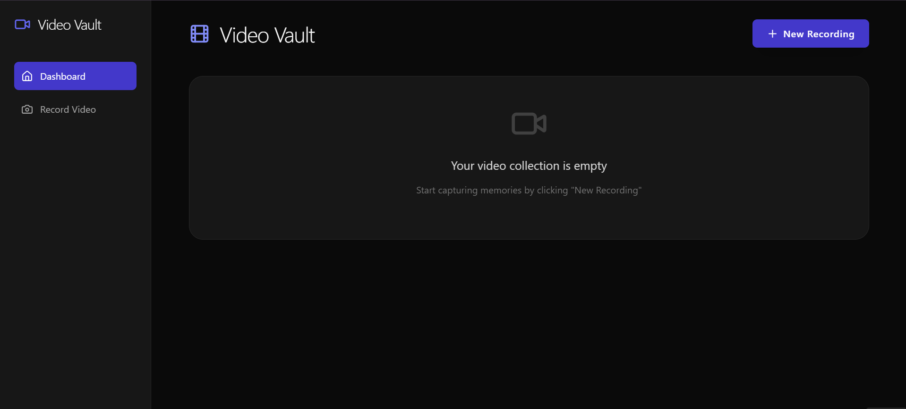

# 🎥 Video Vault


<div align="center">
    
    
</div>


## 🚀 Live Demo
**[Click Here to View Live Application](https://videovault1.vercel.app/)**


## 🌟 Overview

Video Vault is an innovative full-stack video management application that provides a smooth, intuitive experience for recording, storing, and playing back videos. Built with cutting-edge web technologies, it offers users a powerful yet simple platform for video management.


## 💻 Technology Stack

| Technology | Description | Version |
|-----------|-------------|---------|
| Frontend | React.js | 18.2.0 |
| Backend | Flask | 3.1.0 |
| Styling | Tailwind CSS | 3.3.3 |
| Deployment | Cloud Platform | Vercel/Render/Firebase |

## 🔧 Prerequisites

- 🟢 Node.js (v14+)
- 🐍 Python 3.13.1
- 📦 npm
- 🌐 Modern Web Browser

## 📂 Project Structure

```
Video Vault/
│
├── frontend/           # React Frontend
│   ├── src/
│   │   ├── components/
│   │   │   ├── Dashboard.js
│   │   │   ├── VideoPlayer.js
│   │   │   └── VideoRecorder.js
│   └── package.json
│
├── backend/            # Flask Backend
│   ├── app.py
│   ├── videos/
│   └── requirements.txt
│
└── README.md
```

## 🔧 Local Development Setup

### Backend Setup 🐍
```bash
# Navigate to backend
cd backend

# Create virtual environment
python -m venv venv
source venv/bin/activate  # Unix
venv\Scripts\activate     # Windows

# Install dependencies
pip install -r requirements.txt

# Run Flask server
python app.py
```

### Frontend Setup ⚛️
```bash
# Navigate to frontend
cd frontend

# Install dependencies
npm install

# Start development server
npm start
```

## 🌐 Deployment Guide

### Frontend Deployment
- **Platforms**: 
  - Github
  - Vercel

```bash
# Build React App
npm run build
```

### Backend Deployment
- **Platforms**:
  - Render
  - Github
  - Firebase
## ✨ Key Features

- 🎥 **Video Recording**
  - Intuitive interface
  - High-quality capture
- 🖥️ **Video Playback**
  - Smooth streaming
  - Multiple format support to save video
- 📱 **Responsive Design**
  - Works on all devices


## 📧 Contact

**Your Name** - sandeshkhairnar123@gmail.com

**Project Link**: [GitHub Repository](https://github.com/sandeshkhairnar/Video-Vault/tree/main)

---

<div align="center">
    <sub>Built with ❤️ using React.js and Flask</sub>
</div>
